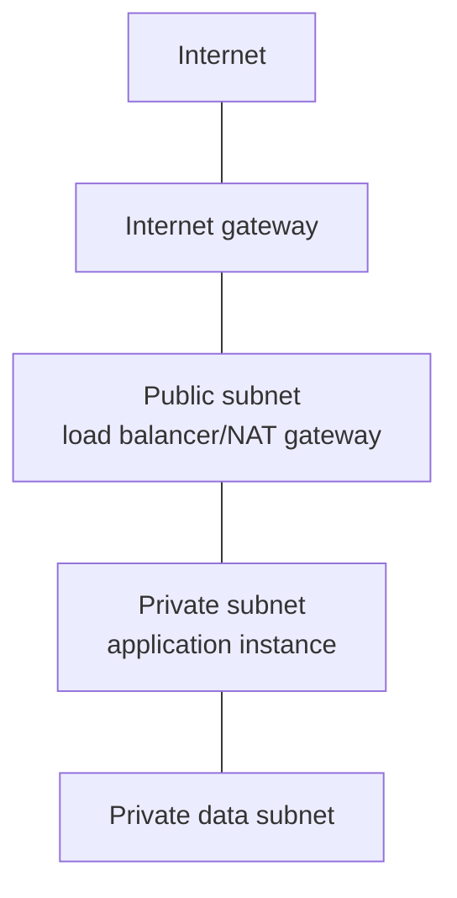

# Provider-Neutral Cloud Networking

## Network+ boundary

Read a virtual network packet path and troubleshoot route/security/DNS dependencies. Provider-specific certifications, transit architecture, multi-account governance, and multi-region design are outside scope.

## Basic topology

| Control | Question |
|---|---|
| Subnet route table | Which next hop serves this destination? |
| Security group | Is this stateful instance/service flow allowed? |
| Network ACL | Are both directions permitted at the subnet boundary? |
| Internet gateway | Can eligible public resources route to/from the Internet? |
| NAT gateway | Can private IPv4 workloads start outbound flows? |
| Peering/VPN/direct connection | Is there a non-Internet or protected path to another network? |

## Troubleshooting scenario

Private instance `10.80.20.25` cannot download updates:

1. Confirm its address, subnet, and DNS resolver.
2. Check the private subnet default route points to the intended NAT gateway.
3. Check NAT gateway health and placement/path to Internet gateway.
4. Check security-group outbound and stateful return behavior.
5. Check stateless network ACL outbound and ephemeral return traffic.
6. Separate DNS lookup, TCP connection, TLS, and application response.

If only a peered network fails, check overlapping address space and routes on both sides. Do not assume cloud networking removes return-path requirements.

## Mini-lab without cloud spend

Draw two virtual networks with non-overlapping RFC 1918 prefixes, public/private subnets, route tables, security groups, and stateless ACLs. For HTTPS outbound and administrator SSH inbound from one management prefix, write every required route and rule direction. Then inject one missing return ACL and explain why stateful and stateless controls behave differently.

