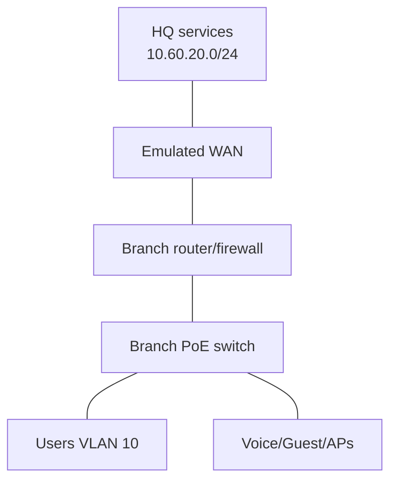

# Pack 06 — Capstone Branch Incident

Do not open [solution.md](solution.md) until completing the ticket.

## Ticket

At 09:10 UTC, Branch A reports:

- Data users can reach local printers but not `app.lab.example` at headquarters.
- Guest clients sometimes reach the internal server VLAN.
- Calls drop after a newly installed AP powers on.

## Topology



## Evidence pack

```text
Branch connected routes: 10.61.10.0/24, 10.61.20.0/24, 10.61.30.0/24
Default route: absent

Guest ACL order:
10 permit udp guest -> approved DNS eq 53
20 permit ip guest -> any
30 deny ip guest -> internal RFC1918

PoE available: 370 W
PoE used before new AP: 352 W
New AP request: 30 W
Log: %ILPOWER-5-IEEE_DISCONNECT: Interface Gi1/0/20 denied power
```

## Deliverables

1. Incident scope and three separate theories.
2. Evidence proving or rejecting each theory.
3. Minimal route, ACL-order, and power-capacity corrections.
4. Change risk, approval, rollback, and postchecks.
5. Technical timeline and nontechnical executive summary.
6. A network diagram, IP/VLAN table, and sanitized before/after outputs.

## Pass conditions

- Users reach the headquarters IP, resolve the name, establish TLS, and use the application.
- Guests retain DHCP/DNS/Internet but cannot reach internal prefixes.
- All approved APs/phones receive required power and sustained test calls meet the lab target.
- Monitoring stays stable for the stated observation period.

