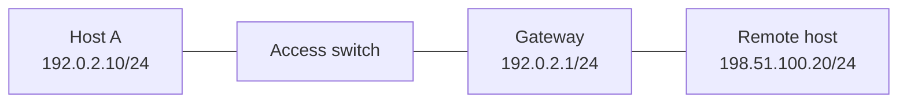

# Pack 01 — Ethernet, ARP, and ICMP

## Topology

Use MAC addresses `00:11:22:33:44:55` for Host A and `00:66:55:44:33:22` for the gateway in the packet-reading exercise.

## Tasks

1. Clear only the authorized lab endpoint neighbor entry and record the MAC table.
2. Start a bounded ARP/ICMP capture.
3. Ping the gateway, then a routed destination.
4. Explain source/destination MAC and IP at each hop.
5. Prove source-MAC learning and unknown-unicast/broadcast flooding boundaries.
6. Introduce a wrong `/25` mask on Host A, predict which local addresses fail, restore `/24`, and verify.

## Assets

- [Synthetic ARP and ICMP capture](captures/arp-icmp.pcap)
- [Expected packet walk](expected.md)

Useful filters: `arp`, `icmp`, `eth.addr == 00:11:22:33:44:55`, and `ip.addr == 192.0.2.10`.

