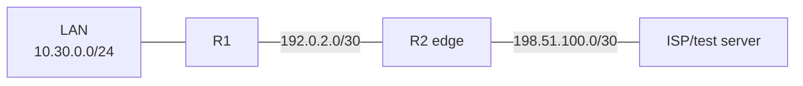

# Pack 03 — OSPF, Default Routing, and PAT

## Topology

## Tasks

1. Complete [starter configuration](starter.cfg) for single-area OSPF between R1/R2.
2. Add a default route on R2 and advertise a default toward R1.
3. Configure PAT on R2 for `10.30.0.0/24` using the outside interface address.
4. Verify neighbor, LSDB/route, route selection, translation, and return traffic.
5. Inject one fault at a time: area mismatch, passive transit interface, missing NAT inside role, or missing default route.
6. Use [solution configuration](solution.cfg) only after documenting evidence.

This pack stops at basic adjacency, route installation, and translation. OSPF multi-area design, BGP policy, and complex redistribution are outside Network+ depth.

