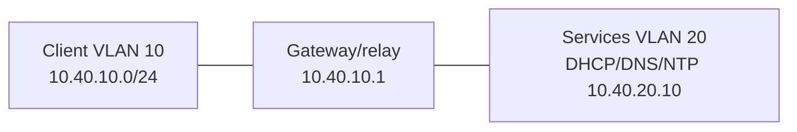

# Pack 04 — DHCP, DNS, and Time

## Topology

## Tasks

1. Adapt [DHCP sample](dhcpd-sample.conf) to an isolated service VM.
2. Configure relay on the VLAN 10 gateway for `10.40.20.10`.
3. Load the [forward zone](db.lab.example) and [reverse zone](db.10.40.20).
4. Capture DORA, query every record, perform forward-confirmed reverse DNS, and record time-source state.
5. Fault cards: exhaust the pool, remove relay, wrong DNS address, stale SOA serial, missing trailing dot, blocked UDP 123, and client clock drift.
6. Compare observations with [expected evidence](expected.md).

Service syntax varies. Validate configuration before restart and keep the lab isolated from public DNS/DHCP.

