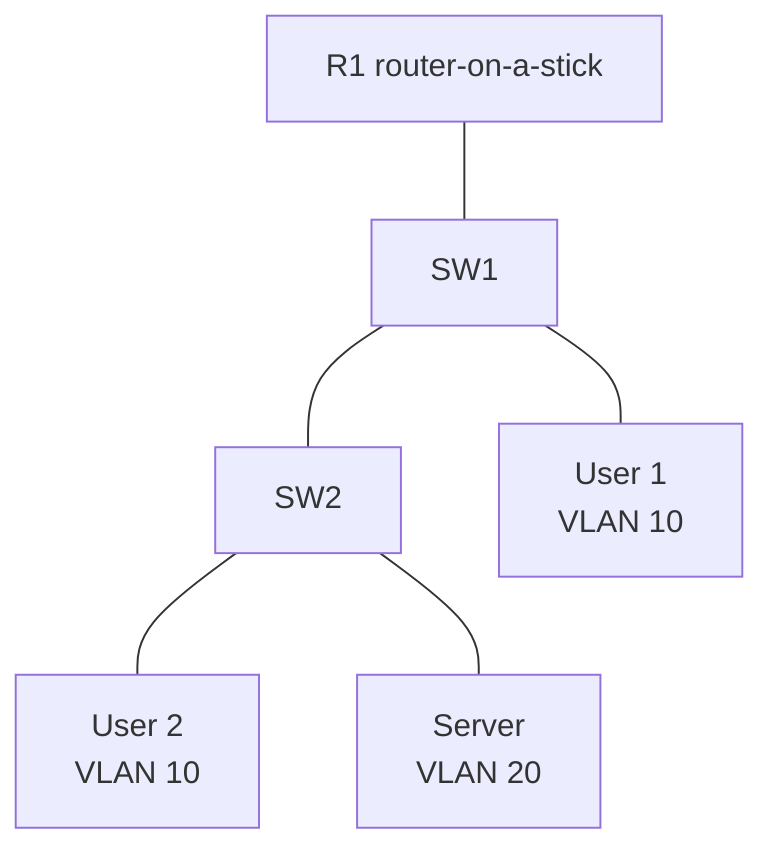

# Pack 02 — VLANs, Trunking, Inter-VLAN Routing, and ACL

## Topology

| VLAN | Purpose | Prefix | Gateway |
|---:|---|---|---|
| 10 | Users | `10.10.10.0/24` | `10.10.10.1` |
| 20 | Servers | `10.10.20.0/24` | `10.10.20.1` |
| 99 | Management | `10.10.99.0/24` | `10.10.99.1` |
| 999 | Unused native | No endpoint subnet | None |

## Tasks

1. Start with [SW1](sw1-starter.cfg), [SW2](sw2-starter.cfg), and [R1](r1-starter.cfg).
2. Create VLANs, access ports, restricted trunks, and router subinterfaces.
3. Permit users to reach server TCP 443 and DNS UDP/TCP 53; deny other user-to-server traffic.
4. Verify VLAN, trunk, MAC, ARP, route, ACL counter, and end-to-end behavior.
5. Fault cards: remove VLAN 20 from one trunk; mismatch native VLAN; apply ACL in wrong direction.
6. Compare with [solution notes](solution.md) and solution configuration files.

